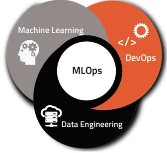

# Proyecto Individual Machine Learning Operations

## En este proyecto se lleva a cabo el rol de un Data Scientist en Steam, se nos facilitan 3 datasets en formato ".json.gz" a partir de los cuales deberemos realizar 5 Endpoints en una API deployada en Render, asi como un Endpoint adicional para un sistema de recomendacion.